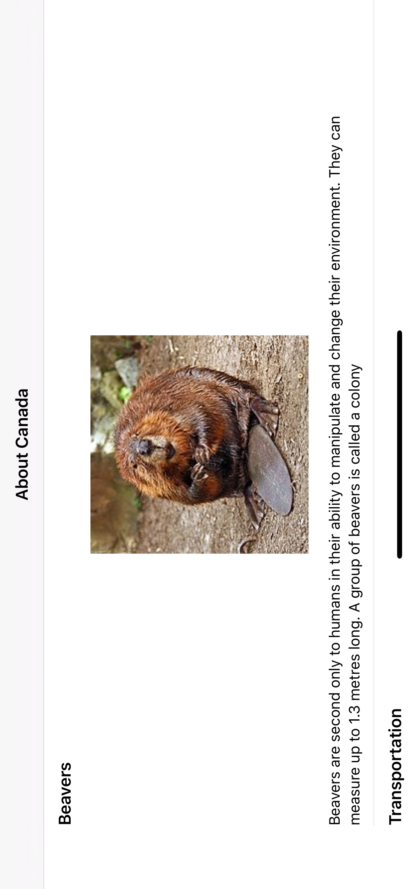

# Assignment
The purpose of this exercise is to assess candidate developer’s iOS coding knowledge and style. The exercise involves build a “proof of concept” app which consumes a REST service and displays photos with headings and descriptions.

# iPhone Portrait 

# iPhone Landscape	

# iPad Portrait	

# iPad Landscape

